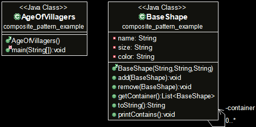

# Problem Scenario
You need to build part of a game named Age of Villagers (AoV). The game is about people from different parts of the world trying to build their villages. The game has a lot of features, of which you need to focus only on the village creation part. A village can have several types of objects like house, tree and water source. Your main task is create the house, tree or water sources by adding different types of simple shapes.

# IDE used
Eclipse

# Explanation
We know that in composite pattern, an object can be made up of similar type of objects. In this project, I have the class **BaseShape**. A shape can have 3 types of properties. ( Color, Size and Shape). A village can have a house, tree and watersources. A house can of different size, of different color and can use different shapes. Same goes for a tree and watersource.
Example of an output is given below:

As the snippet shows, a village can have different types of objects. A object can use different types of simple objects. It will print a hierarchical representation of the village.
